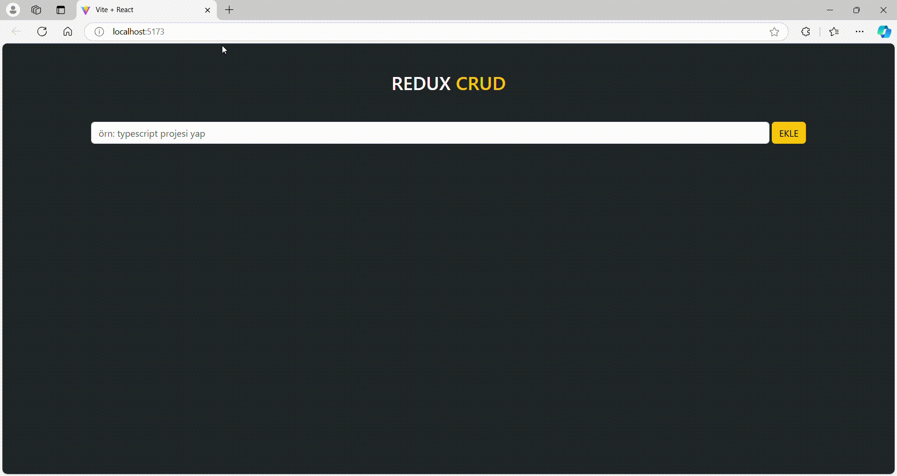

# React + Vite
# CRUD App with Redux

## Proje Açıklaması

Bu proje, kullanıcıların verileri oluşturup (Create), okuyup (Read), güncelleyip (Update) ve silebileceği (Delete) bir CRUD uygulamasıdır. Uygulama, kullanıcı arayüzünü yönetmek için Redux kullanmaktadır.

## Özellikler

- Kullanıcıların yeni veriler eklemesi
- Var olan verilerin görüntülenmesi
- Mevcut verilerin güncellenmesi
- Verilerin silinmesi

## Kullanılan Teknolojiler

- **React**: Kullanıcı arayüzü bileşenlerini oluşturmak için.
- **Redux**: Uygulama durumunu yönetmek için.
- **JavaScript**: Uygulama mantığı için.
- **CSS**: Uygulamanın stilini oluşturmak 
için.
- **Bootstrap**: Uygulamanın stilini oluşturmak ve responsive tasarım sağlamak için.

